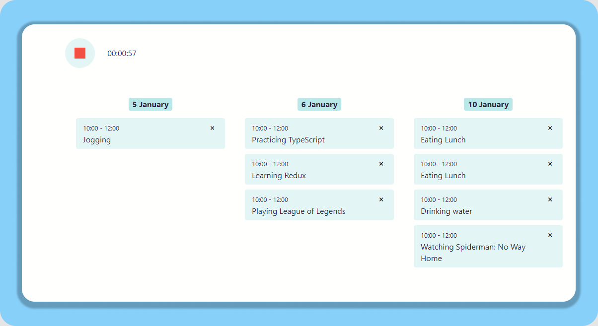

# Simple activity tracker

Built using React and Redux. data stored on a fake server using json-server. 


---
### Run locally

Clone the repostiroy
```bash
$ git clone https://github.com/addison-ch/activity-tracker.git
```

Install dependencies. Make sure you already have [`nodejs`](https://nodejs.org/en/) & [`npm`](https://www.npmjs.com/) installed in your system.
```bash
$ npm install 
```

Run the app
```bash
$ npm start 
```

Start up the fake server
```bash
$ json-server --watch json-server/db.json --port 3001
```
---



